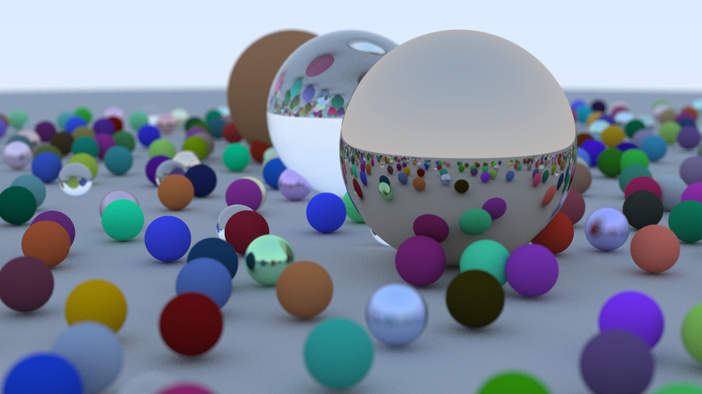
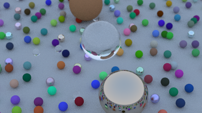
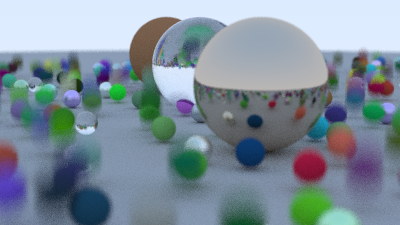

# Ray Tracing Project

### 1. Normal


### 2. Top View


### 3. Motion Blur


Ray tracing is a technique for modeling light transport for use in a wide variety of rendering algorithms for generating digital images.

## Project Structure

- `src/`: Source code files
- `bin/`: Compiled executable

## Prerequisites

- C++17 compatible compiler (g++ recommended)
- Make

## Building the Project

```bash
make render   # Generate ray traced image (output to image.ppm)
make clean    # Clean build artifacts
open image.ppm # However you want, xdg-open image.ppm
```
## References

[_Ray Tracing Book_](https://raytracing.github.io/)
