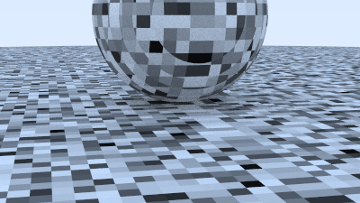
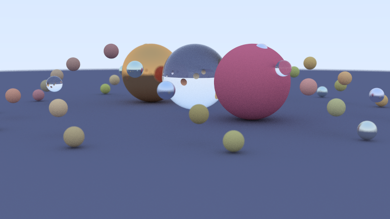
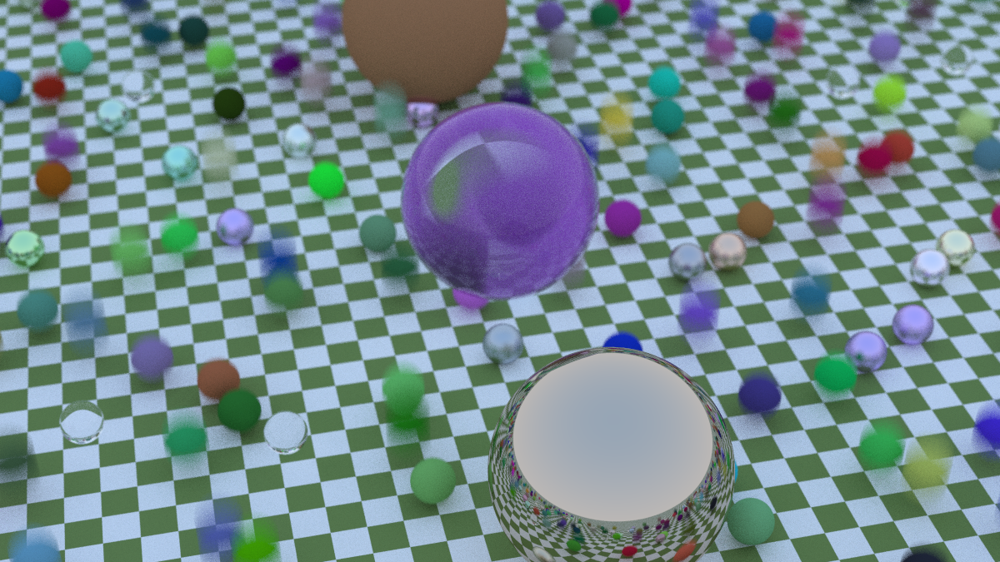
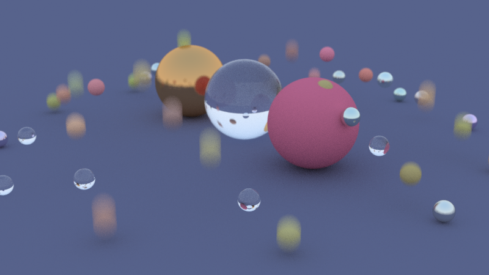

# Ray Tracing Project

### 4. Perlin Texture


### 1. Normal


### 2. Checker top View


### 3. Motion Blur


Ray tracing is a technique for modeling light transport for use in a wide variety of rendering algorithms for generating digital images.

## Project Structure

- `src/`: Source code files

## Prerequisites

- C++17 compatible compiler (g++ recommended)
- Make (or [build it yourself](#building-mannualy))

## Building the Project

### Using make

```bash
make render   # Generate ray traced image (output to image.ppm)
make clean    # Clean build artifacts
open image.ppm # However you want, E.g. xdg-open image.ppm
```

### Building mannualy

```bash
cd src/
g++ main.cpp -o main -std=c++17
main > output.ppm
```

## References

[_Ray Tracing Book_](https://raytracing.github.io/)
